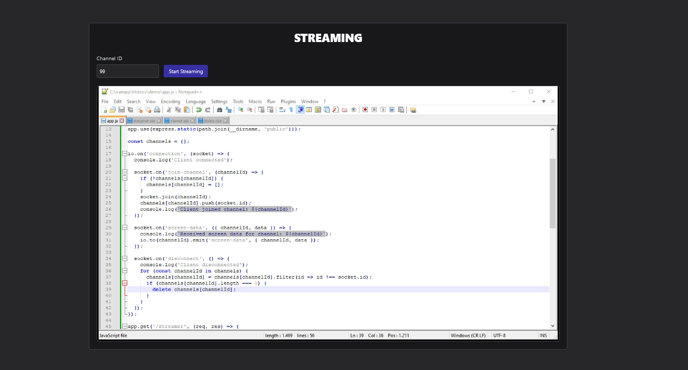

# Screen Streaming Socket.IO

Aplikasi dasar Streaming Layar secara real-time menggunakan teknologi NodeJS dengan Socket.io.

## Installation

```
git clone https://github.com/fitri-hy/screen-streaming-nodejs.git
cd screen-streaming-nodejs
npm install
npm start
```

## Endpoint URL

- Streamer: `http://localhost:3000/streamer`
- Viewer: `http://localhost:3000/`
